# 🏛 Bonsai Hall of Fame

Trees grown from the **public** GitHub history of people whose work shaped
how we all write software. Same rules as everyone: nothing here is drawn by
hand — every trunk, scar and blossom is earned. Regenerate any time with
`node scripts/hall-of-fame.js --token <PAT>` (metrics are cached under
`fixtures/hall/`, so the gallery is reproducible bit-for-bit).

## [@torvalds](https://github.com/torvalds)

*Linus Torvalds — Linux, git*

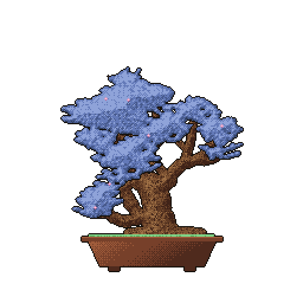

**shakan (slanting)** · pine (matsu) · 15 years · 35,933 public contributions · **sumo trunk** · 3 🌸

## [@gvanrossum](https://github.com/gvanrossum)

*Guido van Rossum — Python*

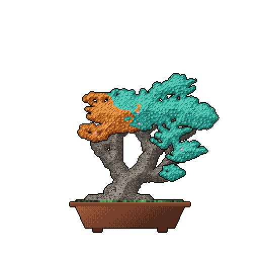

**shakan (slanting)** · maple (momiji) · 14 years · 8,096 public contributions · **sumo trunk** · 2 🌸

## [@antirez](https://github.com/antirez)

*Salvatore Sanfilippo — Redis*

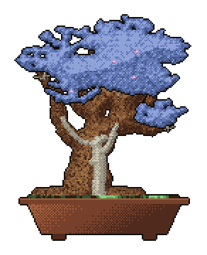

**chokkan (formal upright)** · pine (matsu) · 17 years · 18,480 public contributions · **sumo trunk** · *shari* · 2 🌸

## [@gaearon](https://github.com/gaearon)

*Dan Abramov — React, Redux*

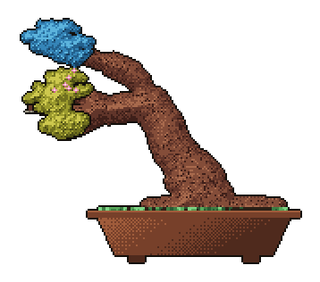

**fukinagashi (windswept)** · cherry (sakura) · 15 years · 77,857 public contributions · **sumo trunk** · 2 🌸

## [@yyx990803](https://github.com/yyx990803)

*Evan You — Vue, Vite*

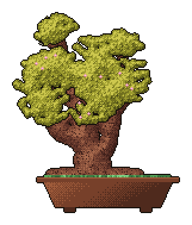

**chokkan (formal upright)** · cherry (sakura) · 16 years · 54,560 public contributions · **sumo trunk** · 4 🌸

## [@sindresorhus](https://github.com/sindresorhus)

*Sindre Sorhus — 1000+ npm packages*

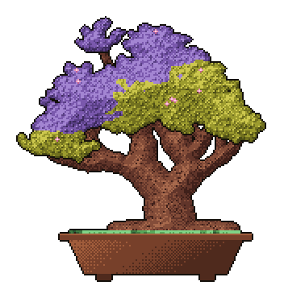

**shakan (slanting)** · cherry (sakura) · 17 years · 47,778 public contributions · **sumo trunk** · 3 🌸

## [@mitchellh](https://github.com/mitchellh)

*Mitchell Hashimoto — Terraform, Vagrant, Ghostty*

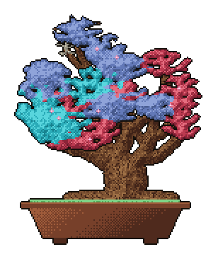

**shakan (slanting)** · pine (matsu) · 18 years · 60,001 public contributions · **sumo trunk** · 4 🌸

## [@karpathy](https://github.com/karpathy)

*Andrej Karpathy — deep learning*

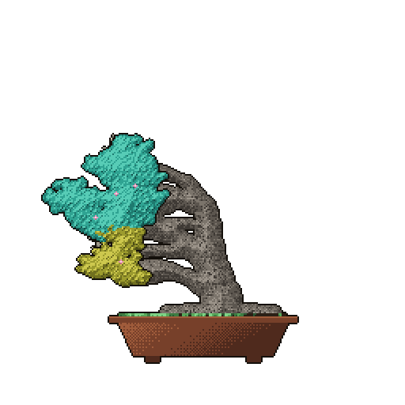

**fukinagashi (windswept)** · maple (momiji) · 16 years · 4,601 public contributions · **sumo trunk** · 2 🌸

## [@ry](https://github.com/ry)

*Ryan Dahl — Node.js, Deno*

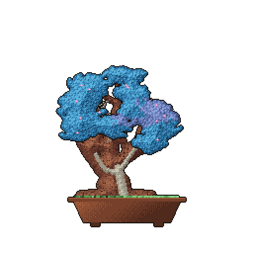

**chokkan (formal upright)** · cherry (sakura) · 18 years · 26,332 public contributions · **sumo trunk** · *shari* · 4 🌸

## [@dhh](https://github.com/dhh)

*David Heinemeier Hansson — Ruby on Rails*

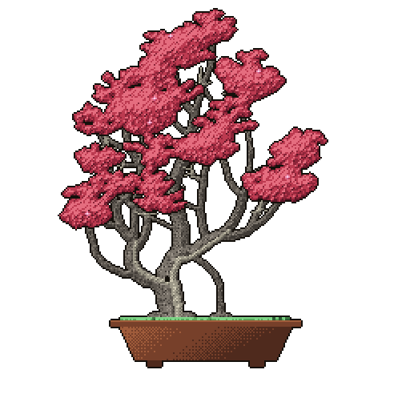

**sokan (twin trunk)** · maple (momiji) · 18 years · 15,068 public contributions · *shari* · *uro* · 3 🌸

## [@Rich-Harris](https://github.com/Rich-Harris)

*Rich Harris — Svelte, Rollup*

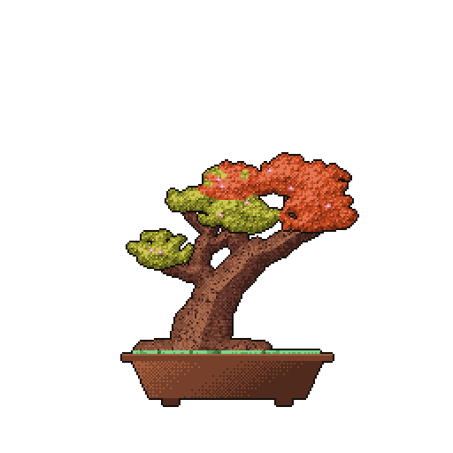

**han-kengai (semi-cascade)** · cherry (sakura) · 15 years · 46,522 public contributions · **sumo trunk** · 3 🌸

## [@taylorotwell](https://github.com/taylorotwell)

*Taylor Otwell — Laravel*

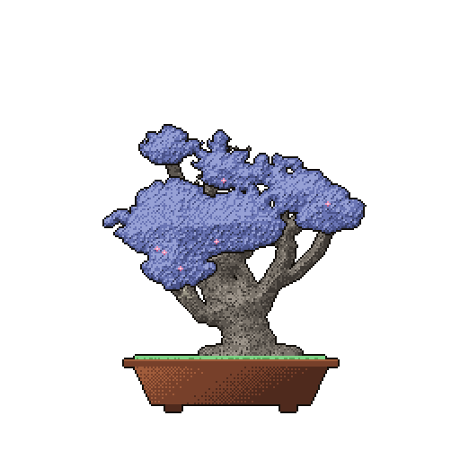

**chokkan (formal upright)** · maple (momiji) · 16 years · 172,201 public contributions · **sumo trunk** · 3 🌸

## [@fabpot](https://github.com/fabpot)

*Fabien Potencier — Symfony*

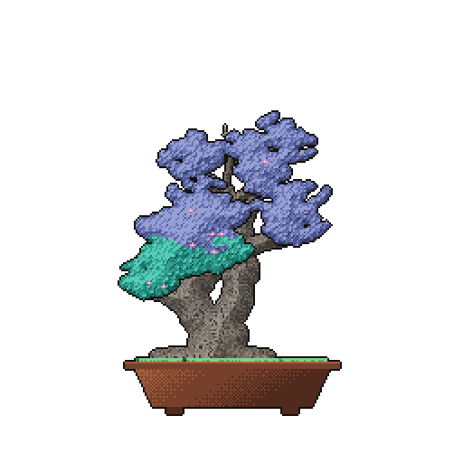

**shakan (slanting)** · maple (momiji) · 17 years · 264,440 public contributions · **sumo trunk** · 4 🌸

## [@mojombo](https://github.com/mojombo)

*Tom Preston-Werner — GitHub co-founder, Jekyll*

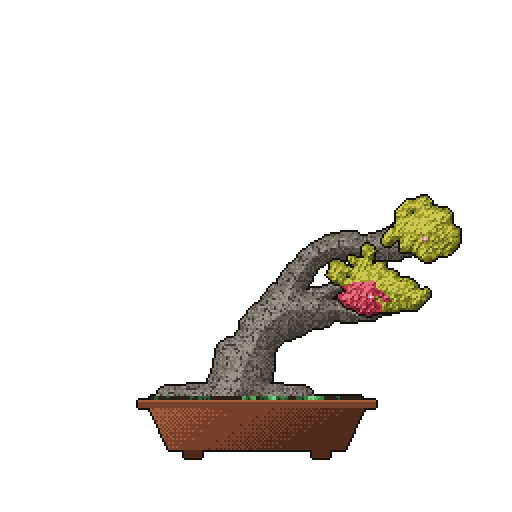

**fukinagashi (windswept)** · maple (momiji) · 19 years · 6,218 public contributions · **sumo trunk** · 1 🌸

## [@tj](https://github.com/tj)

*TJ Holowaychuk — Express, Koa*

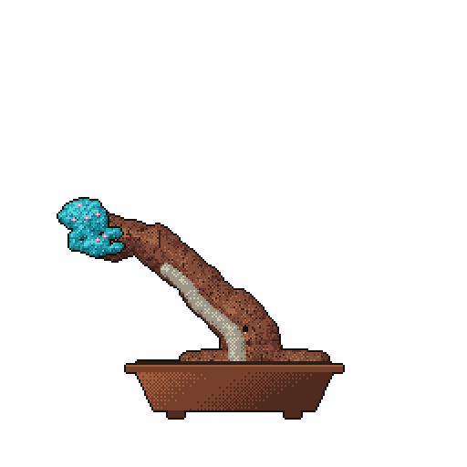

**fukinagashi (windswept)** · cherry (sakura) · 18 years · 37,598 public contributions · **sumo trunk** · *shari* · *uro* · 2 🌸

## [@shadcn](https://github.com/shadcn)

*shadcn — shadcn/ui*

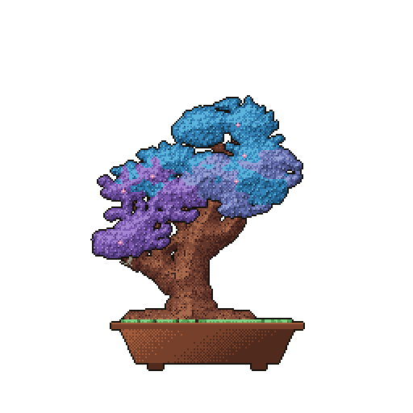

**chokkan (formal upright)** · cherry (sakura) · 17 years · 20,562 public contributions · **sumo trunk** · 2 🌸

## [@claude](https://github.com/claude)

*Claude — the gardener itself; its real work hides in Co-Authored-By trailers, so the calendar shows a bare literati with honorable scars*

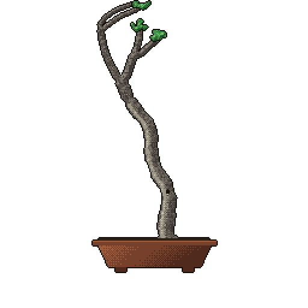

**bunjingi (literati)** · maple (momiji) · 17 years · 0 public contributions · *shari* · *uro*

---

*Grow your own: see the [README](README.md). Post it with **#gitbonsai** —
maybe your tree belongs here too.*
