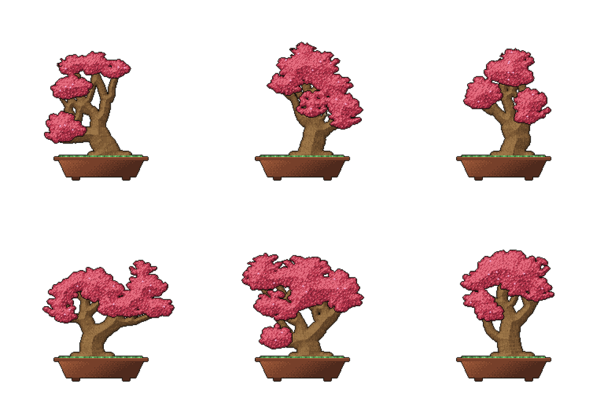
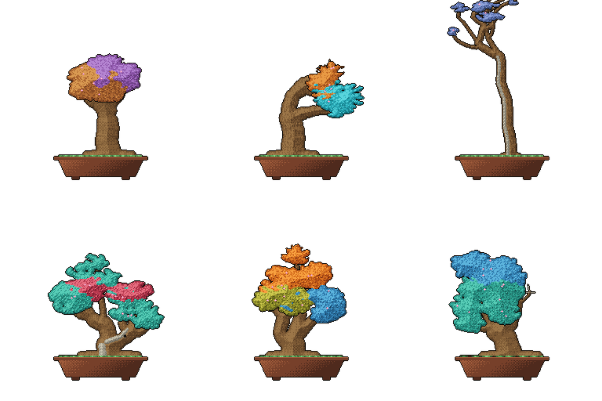
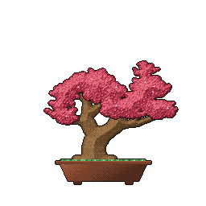
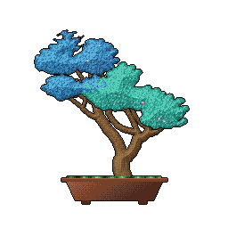

# 🌳 git-bonsai

**Grow a one-of-a-kind pixel-art bonsai from your GitHub history.**

<p align="center">
  
</p>

Every account grows exactly one tree — deterministic, procedural, 16-bit style.
The older your account and the richer your history, the bigger and denser your bonsai.
It keeps growing as you keep committing.

> ### 🌸 Share your bonsai!
> Every tree is unique — your username is its seed and your history is its shape,
> so nobody else can ever grow yours. Post a screenshot with **#gitbonsai**,
> drop a link to your profile in [Discussions](../../discussions), and let
> others see what a decade of commits looks like as a living thing.

## Gallery

Same stats, six different souls — the seed (your username) decides the tree's character:

<p align="center">
  
</p>

Different histories grow different trees entirely — style and species are earned, not chosen.
Left to right: **hokidachi** (broom — metronome consistency, elm), **fukinagashi**
(windswept — bursty storm-coder, pine), **bunjin** (literati — an old minimalist, pine),
a **sumo** trunk with *shari* & *uro* deadwood scars (16 years, one long disappearance, maple),
a three-era cherry (JS → TS → Astro), and a slanted veteran:

<p align="center">
  
</p>

<p align="center">
  
  
</p>

## Why a bonsai?

Bonsai is one of the oldest living art forms. It began in Han-dynasty China as
*penjing* — "tray scenery", miniature landscapes of trees and rock — and came
to Japan around the Kamakura period together with Zen Buddhism, where it was
distilled into the art of a single tree in a single pot. A bonsai is never
finished: it is a decades-long collaboration between the tree and its keeper,
shaped season by season, and it embodies *wabi-sabi* — the beauty of
imperfection and impermanence. A crooked trunk, a dead branch, a scar: these
are not flaws but biography.

That's exactly what your commit history is. git-bonsai just makes the
biography visible: your years become growth rings, your streaks bloom, your
burnout gaps leave honest deadwood. You don't draw this tree — you *live* it.

## The rules of growth 🌱

Like a real bonsai, this tree answers to its keeper. Everything is derived
from your history — here is how to grow what you want:

| you want | you do |
|---|---|
| a taller, thicker trunk | be patient — trunk height, thickness and branching depth come from **account age** (it literally can't be rushed) |
| a denser, fuller crown | commit more — foliage and branch density scale with **total contributions** (private ones count if you let them — see below) |
| sakura blossoms 🌸 | keep streaks: each milestone — **7 / 30 / 100 / 365 days** — adds blossoms, and a live streak of 7+ keeps the tree in bloom |
| no deadwood | don't vanish: every gap longer than **60 days** turns a branch into gray *jin*; a year away carves a *shari* strip down the trunk, and coming back after 2+ years leaves an *uro* hollow — worn with honor |
| a different silhouette | your **rhythm** picks the style: metronome consistency grows a *broom* (hokidachi), commit storms after long silences grow a *windswept* tree (fukinagashi), an old account with few repos grows a *literati* (bunjin), and weekend habits decide between *formal*, *slanted*, *semi-cascade* and *cascade* |
| a massive sumo trunk | a decade of near-daily work unlocks the heavyweight class: a flaring base with visible *nebari* root spread (the more repos, the wider the roots) |
| a different species | your **language family** decides it: systems languages grow layered *pines*, scripting grows round-cloud *maples*, frontend grows blossoming *cherries*, infra grows ragged *junipers*, JVM/.NET grows fine-twigged *elms* |
| different colors | the crown is painted by your **top language of each of three eras** — the lower canopy is your past, the upper is your present; switch stacks and the tree will show it |
| richer soil | the pot's mosaic is your **current year of contributions**, week by week — a green year makes fertile ground |
| a different tree entirely | you can't — the **seed is your username**, forever. Like a real tree, you work with the nature you were given 🙏 |

Two switches worth knowing:

- **Count private work.** Enable *Private contributions* on your profile
  (the gear above your contribution calendar) — the crown fills out using your
  full commit count, no token required.
- **Count private languages.** Pass a PAT with repo access as `github-token`
  (store it as a repo secret!) and your private stack colors the crown too.

## Install (3 lines of YAML)

Add `.github/workflows/bonsai.yml` to your profile repo (the one named after your username):

```yaml
name: bonsai
on:
  schedule:
    - cron: '0 3 * * *'   # re-grow daily
  workflow_dispatch:
permissions:
  contents: write
jobs:
  grow:
    runs-on: ubuntu-latest
    steps:
      - uses: actions/checkout@v4
      - uses: egorthinks/git-bonsai@main
```

Then embed the tree in your `README.md`:

```html

```

The action writes and commits four files: `bonsai.svg` (static), `bonsai.png`,
`bonsai.gif` (wind loop) and `bonsai-growth.gif` (seed-to-tree timelapse).

### Action inputs

| input | default | |
|---|---|---|
| `github-token` | `${{ github.token }}` | token for the GraphQL API & pushing |
| `user` | repo owner | account to grow the bonsai for |
| `output-dir` | `output` | where to write the images |
| `commit` | `true` | commit & push the result |
| `commit-message` | `chore: tend the bonsai 🌳` | |

## Local preview (no push, no token needed)

```bash
npx git-bonsai --user yourname --token $GITHUB_TOKEN   # real data
npx git-bonsai --synth yourname                        # offline demo
```

## How it works

100% procedural, zero pre-drawn trees, zero runtime dependencies. Data flows
through pure functions, one module per stage:

```
data      GitHub GraphQL → normalized metrics
seed      username → FNV-1a → sfc32 PRNG
dna       metrics + PRNG → tree genotype
skeleton  stochastic L-system (trunk & branches) + space colonization (twigs)
thickness pipe model / Murray's law
raster    Bresenham + scanline capsule fill → 256×256 indexed buffer
shade     8SSEDT SDF volume → posterized light → Bayer dithering → keyline
foliage   Poisson-disk (Bridson) leaves, simplex silhouette, blossoms
animate   wind (sine + simplex, seamless loop) & growth timelapse
encode    hand-rolled GIF89a (LZW) + PNG + SVG snapshot
```

**Determinism is a hard guarantee:** the same username with the same metrics
produces bit-identical bytes on every run. No `Math.random()` anywhere —
only the seeded PRNG. Real pixel art too: everything is rendered onto a small
integer buffer with a fixed 32-color palette, then upscaled nearest-neighbor.

## Develop

```bash
npm install
npm test          # determinism + acceptance criteria
npm run demo      # render fixtures/veteran.json into out/
```

`dist/` is committed intentionally — the GitHub Action runs straight from it
without an install step. See [ROADMAP.md](ROADMAP.md) for where this is going:
more traditional styles (bunjin, fukinagashi, hokidachi…), species-like
crowns, massive sumo trunks.

## License

MIT
